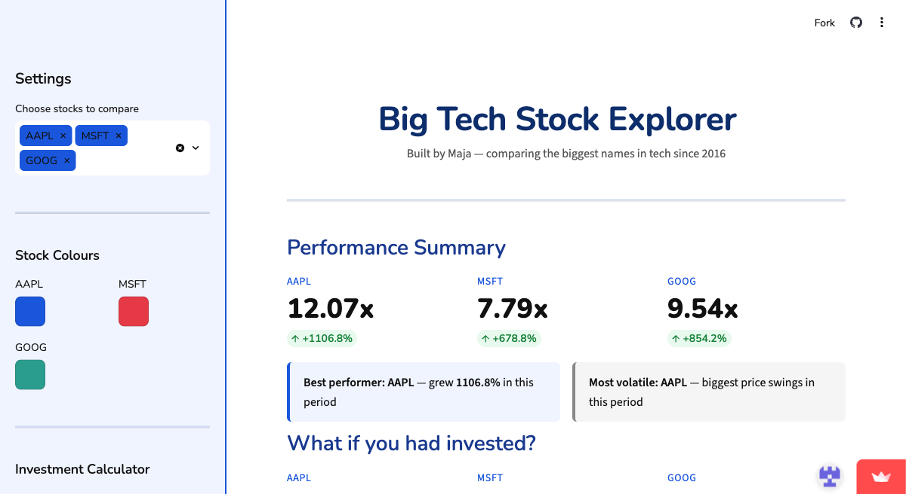

# Big Tech Stock Explorer

A Streamlit app built by Maja for exploring and comparing Big Tech stock performance since 2016.

**Live app:** https://stock-explorer-cdnnu783kdmuqkqsv5cspv.streamlit.app



---

## Architecture

```mermaid
flowchart LR
    YF["🌐 Yahoo Finance\n(Market Data)"]
    YFP["📦 yfinance\n(Python Library)"]
    APP["🐍 app.py\n(Streamlit App)"]
    GH["🐙 GitHub\nmajcimakoric09/stock-explorer"]
    SC["☁️ Streamlit Cloud\nstreamlit.app"]
    USER["📱 User\n(Browser / Mobile)"]

    YF -->|"Real-time prices\nvia REST API"| YFP
    YFP -->|"Pandas DataFrame\nClose prices 2016–now"| APP
    APP -->|"git push\n(via GitHub API)"| GH
    GH -->|"Auto-deploy\non every push"| SC
    SC -->|"Live web app\nover HTTPS"| USER

    style YF fill:#f0f4ff,stroke:#1a56db,color:#0d2d6b
    style YFP fill:#dbeafe,stroke:#1a56db,color:#0d2d6b
    style APP fill:#1a56db,stroke:#0d2d6b,color:#ffffff
    style GH fill:#111111,stroke:#333,color:#ffffff
    style SC fill:#ff4b4b,stroke:#cc0000,color:#ffffff
    style USER fill:#f0fdf4,stroke:#2a9d8f,color:#0d2d6b
```



---

## Features

- Real stock data via **yfinance** — 10 years of history from 2016
- Compare **AAPL, MSFT, GOOG, AMZN, NFLX, META, MRNA, INTC, AMD, PFE** and the **S&P 500**
- Investment calculator in **euros** — see what €1,000 invested in 2016 is worth today
- **Price Growth Over Time** — normalized line chart
- **Total Growth Comparison** — bar chart with % labels
- **Annual Returns by Year** — grouped bar chart per calendar year
- Custom **colour pickers** per stock
- **Date range slider** — filter to any period
- **Daily investing quote** — changes every morning
- **Podcast recommendations** — curated list for investors
- **Mobile-friendly** — columns stack vertically on small screens, sidebar collapses by default

## Tech Stack

| Layer | Technology |
|-------|-----------|
| Data | Yahoo Finance via `yfinance` |
| App | Python · Streamlit · Plotly Express · Pandas |
| Styling | CSS media queries · Google Fonts (Nunito) |
| Hosting | Streamlit Community Cloud |
| Version control | GitHub |

## How to run locally

```bash
pip install streamlit pandas plotly yfinance
streamlit run app.py
```

---

## Reflection

This was my first time building and deploying a full data app from scratch, and it taught me more than I expected.

The hardest part was working with real market data. I initially assumed stock prices could be compared directly, but quickly learned they need to be **normalised** — indexed to 1.00 at the start of the period — otherwise a €3,000 stock always looks bigger than a €150 stock regardless of how it actually performed. Getting that mental model right changed how I read the charts.

I also underestimated how much effort goes into making something feel good on mobile. Streamlit's column layout doesn't stack automatically on small screens, so I had to write custom CSS media queries to force the columns to collapse vertically. That was frustrating at first but made me appreciate how much work goes into responsive design.

The investment calculator surprised me most in terms of usefulness. Showing a simple total return is fine, but switching to **CAGR (Compound Annual Growth Rate)** made the numbers feel real — a 900% total return over 10 years sounds abstract, but "roughly +26% per year" is something you can actually reason about.

If I were to continue this project, I would add a portfolio builder where users can mix multiple stocks with custom weights, and a proper news feed that filters by the stocks the user has selected rather than always showing Apple headlines.
