# Big Tech Stock Explorer

A Streamlit app built by Maja for exploring and comparing Big Tech stock performance since 2016.

**Live app:** https://stock-explorer-cdnnu783kdmuqkqsv5cspv.streamlit.app

---

## Architecture

```mermaid
flowchart LR
    YF["🌐 Yahoo Finance\n(Market Data)"]
    YFP["📦 yfinance\n(Python Library)"]
    APP["🐍 app.py\n(Streamlit App)"]
    GH["🐙 GitHub\nmajcimakoric09/stock-explorer"]
    SC["☁️ Streamlit Cloud\nstreamlit.app"]
    USER["📱 User\n(Browser / Mobile)"]

    YF -->|"Real-time prices\nvia REST API"| YFP
    YFP -->|"Pandas DataFrame\nClose prices 2016–now"| APP
    APP -->|"git push\n(via GitHub API)"| GH
    GH -->|"Auto-deploy\non every push"| SC
    SC -->|"Live web app\nover HTTPS"| USER

    style YF fill:#f0f4ff,stroke:#1a56db,color:#0d2d6b
    style YFP fill:#dbeafe,stroke:#1a56db,color:#0d2d6b
    style APP fill:#1a56db,stroke:#0d2d6b,color:#ffffff
    style GH fill:#111111,stroke:#333,color:#ffffff
    style SC fill:#ff4b4b,stroke:#cc0000,color:#ffffff
    style USER fill:#f0fdf4,stroke:#2a9d8f,color:#0d2d6b
```



---

## Features

- Real stock data via **yfinance** — 10 years of history from 2016
- Compare **AAPL, MSFT, GOOG, AMZN, NFLX, META, MRNA, INTC, AMD, PFE** and the **S&P 500**
- Investment calculator in **euros** — see what €1,000 invested in 2016 is worth today
- **Price Growth Over Time** — normalized line chart
- **Total Growth Comparison** — bar chart with % labels
- **Annual Returns by Year** — grouped bar chart per calendar year
- Custom **colour pickers** per stock
- **Date range slider** — filter to any period
- **Daily investing quote** — changes every morning
- **Podcast recommendations** — curated list for investors
- **Mobile-friendly** — columns stack vertically on small screens, sidebar collapses by default

## Tech Stack

| Layer | Technology |
|-------|-----------|
| Data | Yahoo Finance via `yfinance` |
| App | Python · Streamlit · Plotly Express · Pandas |
| Styling | CSS media queries · Google Fonts (Nunito) |
| Hosting | Streamlit Community Cloud |
| Version control | GitHub |

## How to run locally

```bash
pip install streamlit pandas plotly yfinance
streamlit run app.py
```
